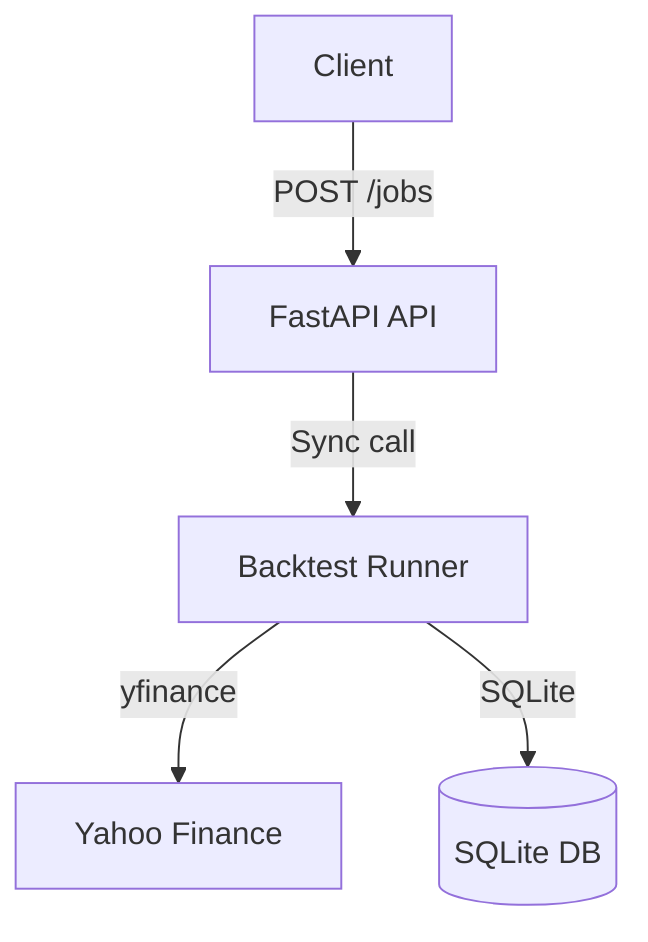

# Backgrid - Learning Project: Backtesting Engine

**Status**: Phase 1 - MVP (In Progress)

**Goal**: Learn distributed systems by building a real backtesting platform from scratch

**Live Demo**: Not yet deployed (Phase 2 target)

---

## Quick Demo (Phase 1)

```bash
# Clone and run
git clone https://github.com/you/backgrid && cd backgrid
python -m venv .venv && source .venv/bin/activate
pip install -r requirements.txt
python src/api.py

# Submit a backtest
curl -X POST http://localhost:8000/api/v1/jobs \
  -H "Content-Type: application/json" \
  -d '{"symbol":"AAPL","strategy":"ma_crossover","start":"2020-01-01"}'

# Response
{
  "job_id": "manual-2025-01-15-123456",
  "status": "completed",
  "sharpe": 1.23,
  "max_drawdown": -0.18,
  "equity_curve": [...],
  "runtime_seconds": 2.3
}
```

---

## Architecture Evolution

### Phase 1: Monolith (Now)


**Components:**
- **API**: Single `POST /api/v1/jobs` endpoint
- **DB**: SQLite file (backgrid.db)
- **Data**: Direct yfinance calls
- **Testing**: Manual + 3 unit tests

**Performance:**
- **Throughput**: ~10 jobs/minute
- **Latency**: 2-8s per job
- **Status**: Working but synchronous

### Phase 2: Async Workers (Planned)

**Trigger**: Measured job latency >5s causes HTTP timeouts
**Addition**: Celery + Redis + PostgreSQL

**Target**: 10 jobs/sec with <2s latency
**Expected**: Week 3-4

### Phase 3: Performance (Future)

**Trigger**: Profiler shows metrics calculation >50% runtime
**Additions**: Go gRPC service + TimescaleDB + JWT Auth

**Target**: 5-10x metrics speedup, <500ms queries
**Expected**: Week 6-8 (only after Phase 2 receipts)

---

## Decision Log

Every major technology addition is documented with a complexity receipt:

| Date | Technology | Problem | Impact | Receipt |
|------|------------|---------|--------|---------|
| TBD  | Celery + Redis | Jobs blocking API | - | [Pending] |
| TBD  | Go gRPC | Metrics bottleneck | - | [Pending] |
| TBD  | TimescaleDB | Slow queries on 25M rows | - | [Pending] |

See full log: [DECISION_LOG.md](DECISION_LOG.md)

---

## What Works Now (Phase 1)

### Implemented
- Single endpoint `POST /api/v1/jobs` (synchronous)
- MA crossover strategy
- Sharpe ratio and max drawdown calculation
- SQLite result storage
- Basic error handling

### Known Limitations
- Synchronous only (blocks for 2-8 seconds)
- No data caching (re-fetches from Yahoo every time)
- No authentication (single user only)
- No UI (curl only)
- No portfolio optimization

---

## Tech Stack (Per Phase)

### Phase 1 (Current)
- **FastAPI**: API framework
- **SQLite**: Database
- **pandas**: Data analysis
- **yfinance**: Market data
- **pytest**: Testing

### Phase 2 (Planned)
- **Celery**: Task queue
- **Redis**: Message broker
- **PostgreSQL**: Concurrent DB

### Phase 3 (Conditional)
- **Go**: Metrics service (if profiling proves need)
- **TimescaleDB**: Time-series DB (if queries slow)
- **PyJWT**: Authentication (if multiple users)

---

## Running Locally (Phase 1)

```bash
# Setup
git clone https://github.com/you/backgrid && cd backgrid
python -m venv .venv && source .venv/bin/activate
pip install -r requirements.txt

# Run
python src/api.py

# Test
curl -X POST http://localhost:8000/api/v1/jobs \
  -d '{"symbol":"AAPL","strategy":"ma_crossover","start":"2020-01-01"}' | jq
```

---

## Testing

### Phase 1 Tests
```bash
# Run unit tests
pytest tests/

# Manual smoke test
./scripts/smoke_test.sh
```

**Coverage**: 50% target (core backtest logic)

---

## Learning Goals

### Technical:
- [] Build working backtest engine (Phase 1)
- [ ] Implement async workers (Phase 2)
- [ ] Profile and optimize bottlenecks (Phase 3)
- [ ] Learn Go concurrency (Phase 3)

### Systems Thinking:
- [ ] Document architectural decisions
- [ ] Practice measurement-driven development
- [ ] Show evolution over time

---

## Contributing

This is a learning project, not production software. Feedback welcome, but expect honest, in-progress code.

---

## License

MIT
