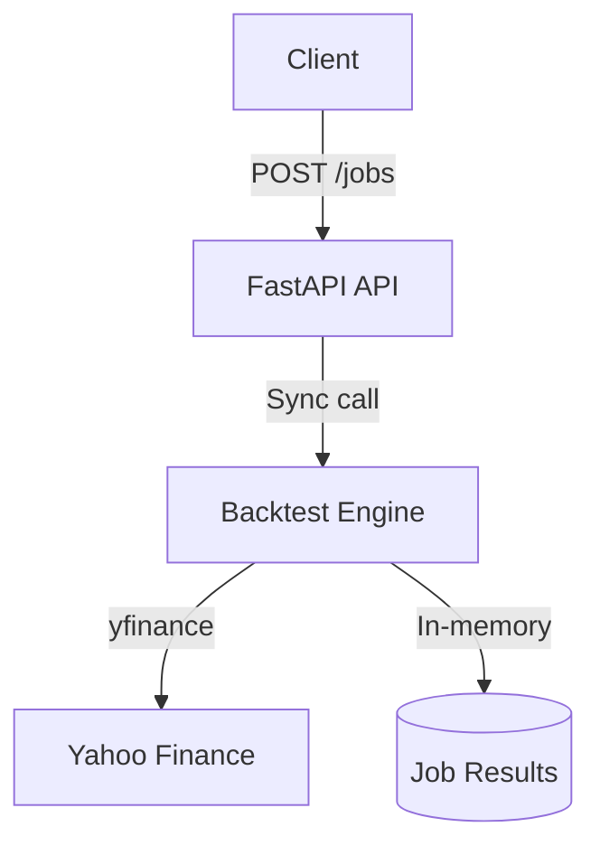

# Backgrid - Backtesting Engine

**Status**: ✅ **Phase 1 - MVP COMPLETE**

**Goal**: Build a real backtesting platform from scratch, evolving from monolith to distributed system

**Repository**: https://github.com/Thinh-nguyen-03/backgrid

---

## Quick Start

```bash
# Clone and setup
git clone https://github.com/Thinh-nguyen-03/backgrid
cd backgrid
pip install -r requirements.txt

# Start the API
python src/api.py
```

### Web UI (Fastest Way)
Open browser to http://localhost:8000
- Fill in symbol, dates, MA parameters
- Click Submit → See JSON results instantly
- No build step, no npm, no framework

### API Usage (Alternative)

```bash
curl -X POST http://localhost:8000/api/v1/jobs \
  -H "Content-Type: application/json" \
  -d '{"symbol":"AAPL","strategy":"ma_crossover","params":{"fast":10,"slow":30},"start":"2023-01-01","end":"2023-12-31"}'
```

**Example Response:**
```json
{
  "job_id": "manual-20251109-014101",
  "status": "completed",
  "sharpe": 0.7739,
  "max_drawdown": -0.1684,
  "total_return": 0.1111,
  "equity_curve": [10000, 10050, ...],
  "runtime_seconds": 2.66
}
```

---

## Phase 1 - What's Built ✅

### Architecture


### Features Implemented
- ✅ **Simple HTML UI** (single file, zero dependencies, <30 lines)
- ✅ **3 REST API endpoints** (health, submit job, get job)
- ✅ **MA Crossover strategy** with configurable periods
- ✅ **Real market data** from Yahoo Finance
- ✅ **Performance metrics**: Sharpe ratio, max drawdown, total return
- ✅ **Full equity curves** for visualization
- ✅ **Comprehensive error handling** and validation
- ✅ **99 passing unit tests** (models, data, backtest, API)
- ✅ **Automated smoke tests** for end-to-end verification

### Performance (Measured)
- **Latency**: 2-3 seconds per backtest
- **Throughput**: ~20 jobs/minute (synchronous)
- **Data fetched**: 250 trading days in <3s
- **Test coverage**: 99 tests across all components

### Tech Stack
- **FastAPI** - Modern async web framework
- **pandas** - Data manipulation and analysis
- **yfinance** - Market data provider (Yahoo Finance)
- **pytest** - Testing framework
- **In-memory storage** - Results stored during runtime

---

## Testing

### Run All Unit Tests
```bash
pytest tests/ -v
# 99 tests, ~2 seconds
```

### Run Smoke Tests
```bash
# Start API first: python src/api.py
python scripts/smoke_test.py
# Tests: health check, job submission, retrieval, error handling
```

### Manual Testing
```bash
# Web UI (simplest)
open http://localhost:8000

# Health check
curl http://localhost:8000/api/v1/health

# Interactive API docs
open http://localhost:8000/docs
```

---

## Known Limitations (Phase 1)

- **Synchronous execution** - Jobs block the API (no async workers yet)
- **In-memory storage** - Results lost when server restarts
- **Single strategy** - Only MA crossover implemented
- **No data caching** - Re-fetches from Yahoo Finance every time
- **No authentication** - Open API (single-user mode)
- **Basic UI** - Simple HTML form (no charts or advanced visualization)

These are **intentional** - Phase 1 proves the core logic works. Future phases will address them based on measured need.

---

## Project Structure

```
backgrid/
├── src/
│   ├── api.py          # FastAPI endpoints
│   ├── backtest.py     # Core backtesting engine
│   ├── data.py         # Market data fetcher
│   ├── models.py       # Pydantic request/response models
│   └── ui.py           # Simple HTML UI (20 lines)
├── tests/
│   ├── test_api.py     # API endpoint tests (19 tests)
│   ├── test_backtest.py # Backtest logic tests (32 tests)
│   ├── test_data.py    # Data fetcher tests (26 tests)
│   └── test_models.py  # Model validation tests (22 tests)
├── scripts/
│   └── smoke_test.py   # Automated smoke tests
├── docs/               # Design docs and architecture
└── requirements.txt
```

---

## API Documentation

### Endpoints

**Health Check**
```bash
GET /api/v1/health
# Returns: {"status": "ok", "phase": 1, "timestamp": "..."}
```

**Submit Backtest Job**
```bash
POST /api/v1/jobs
Content-Type: application/json

{
  "symbol": "AAPL",
  "strategy": "ma_crossover",
  "params": {"fast": 10, "slow": 30},
  "start": "2023-01-01",
  "end": "2023-12-31"
}

# Returns: Job results with metrics and equity curve
```

**Get Job Results**
```bash
GET /api/v1/jobs/{job_id}
# Returns: Same as POST response
```

**Interactive Docs**: http://localhost:8000/docs

---

## Future Phases (Planned)

### Phase 2: Async Workers
**When**: When synchronous execution becomes a bottleneck
**What**: Celery + Redis for async job processing
**Why**: Support multiple concurrent users

### Phase 3: Performance & Scale
**When**: After profiling shows specific bottlenecks
**What**: Go gRPC service for metrics, TimescaleDB for time-series, JWT auth
**Why**: Only add complexity when measurements prove it's needed

See [docs/ARCHITECTURE.md](docs/ARCHITECTURE.md) for detailed evolution plan.

---

## Development Decisions

All major decisions are documented in [docs/DECISION_LOG.md](docs/DECISION_LOG.md) with:
- Problem being solved
- Alternatives considered
- Measurements/benchmarks
- Impact after implementation

Example decisions from Phase 1:
- ✅ FastAPI over Flask (better async support for future)
- ✅ In-memory storage over database (simplicity for MVP)
- ✅ yfinance over paid data (free, good enough for learning)
- ✅ MA crossover only (prove one strategy works first)

---

## Contributing

This is a **learning project** showing incremental system evolution. Feedback welcome!

**Please note:**
- Phase 1 is intentionally simple
- Future complexity will be added based on measured need
- Each phase is tagged in git history

---

## License

MIT

---

## Acknowledgments

Built to learn distributed systems through practical implementation.
