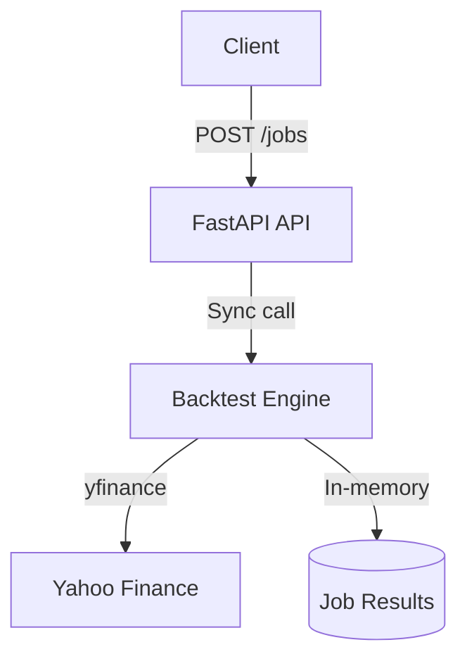

# Backgrid - Backtesting Engine

**Status**: **Phase 2 - Week 8 COMPLETE** (UI Modernization)

**Goal**: Build a real backtesting platform from scratch, evolving from monolith to distributed system

**Repository**: https://github.com/Thinh-nguyen-03/backgrid

---

## Deployment Modes

Backgrid supports two deployment configurations:

**Local Development (SQLite)**
```bash
# Uses SQLite database (backgrid.db)
# Configured via .env: DATABASE_URL=sqlite:///./backgrid.db
pip install -r requirements.txt
uvicorn src.api:app --reload --port 8000
```

**Docker Deployment (PostgreSQL)**
```bash
# Uses PostgreSQL + Redis + Celery workers
# Configured via docker-compose.yml
docker-compose up
```

Choose SQLite for development/testing or PostgreSQL for production-scale deployment.

---

## Quick Start

```bash
# Clone and setup
git clone https://github.com/Thinh-nguyen-03/backgrid
cd backgrid
pip install -r requirements.txt

# Start the API
python src/api.py
```

### Web UI (Fastest Way)

```bash
# Build frontend (one-time)
cd frontend && npm install && npm run build && cd ..

# Start API server
uvicorn src.api:app --reload --port 8000
```

Open browser to http://localhost:8000
- Select strategy (MA Crossover, RSI, Combined)
- Configure execution parameters (position sizing, transaction costs)
- Run single-symbol or portfolio batch backtests
- View equity curves, trade ledger, and job history

### API Usage (Alternative)

```bash
# MA Crossover Strategy
curl -X POST http://localhost:8000/api/v1/jobs \
  -H "Content-Type: application/json" \
  -d '{"symbol":"AAPL","strategy":"ma_crossover","params":{"fast":10,"slow":30},"start":"2023-01-01","end":"2023-12-31"}'

# RSI Strategy
curl -X POST http://localhost:8000/api/v1/jobs \
  -H "Content-Type: application/json" \
  -d '{"symbol":"AAPL","strategy":"rsi","params":{"rsi_period":14,"oversold_threshold":30,"overbought_threshold":55},"start":"2023-01-01","end":"2023-12-31"}'
```

**Example Response:**
```json
{
  "job_id": "manual-20251109-014101",
  "status": "completed",
  "sharpe": 0.7739,
  "max_drawdown": -0.1684,
  "total_return": 0.1111,
  "equity_curve": [10000, 10050, ...],
  "runtime_seconds": 2.66
}
```

---

## Phase 1 - What's Built

### Architecture

```mermaid
graph TD
    A[Client] -->|POST /jobs| B[FastAPI API]
    B -->|Sync call| C[Backtest Engine]
    C -->|yfinance| D[Yahoo Finance]
    C -->|In-memory| E[(Job Results)]
```

### Features Implemented
- **Modern Web UI** (Vite + vanilla JS, Chart.js equity curves, brutalist design)
- **9 REST API endpoints** (health, submit job, get job, portfolio, trades, multi-strategy, symbols, sectors, portfolio trades)
- **Symbol browsing**: Browse 503 S&P 500 symbols organized by 11 GICS sectors with collapsible groups and search
- **Multiple trading strategies**:
  - MA Crossover with configurable periods
  - RSI mean reversion with 2-of-3 confirmation logic
  - Multi-strategy combination (OR, AND, PRIORITY, WEIGHTED)
- **Pluggable data loaders**: Yahoo Finance + PostgreSQL (RapidTrader) + S&P 500 (us500.com with Wikipedia fallback)
- **ATR-based position sizing** with volatility-adjusted risk
- **Transaction cost modeling**: commission, spread, slippage
- **Risk management**:
  - Market regime filter (SPY 200-SMA bull/bear detection)
  - ATR-based stop losses with cooldown periods
  - Sector concentration limits (30% max per sector)
  - Portfolio heat tracking (aggregate risk exposure)
- **Real market data** from Yahoo Finance or RapidTrader PostgreSQL
- **Performance metrics**: Sharpe ratio, max drawdown, total return, win rate
- **Full equity curves** and trade ledger
- **Comprehensive error handling** and validation
- **660 passing unit tests** across all modules
- **Automated smoke tests** for end-to-end verification

### Performance (Measured)
- **Latency**: 2-3 seconds per backtest
- **Throughput**: ~20 jobs/minute (synchronous)
- **Data fetched**: 250 trading days in <3s
- **Test coverage**: 660 tests across all components (>95% on critical paths)
- **Signal calculation**: <10ms for 252 trading days
- **ATR calculation**: <5ms for 252 trading days
- **Position sizing**: <1ms per calculation

### Tech Stack
- **FastAPI** - Modern async web framework
- **Vite + Vanilla JS** - Frontend build tooling and component architecture
- **Chart.js** - Equity curve visualization
- **pandas** - Data manipulation and analysis
- **yfinance** - Market data provider (Yahoo Finance)
- **BeautifulSoup4** - HTML parsing for S&P 500 symbol data
- **SQLAlchemy + Alembic** - Database ORM and migrations (SQLite or PostgreSQL)
- **Celery + Redis** - Async task processing (Docker mode)
- **pytest** - Testing framework (660 tests)

---

## Testing

### Run All Unit Tests
```bash
pytest tests/ -v
# 660 tests, ~10 seconds
```

### Run Smoke Tests
```bash
# Start API first: python src/api.py
python scripts/smoke_test.py
# Tests: health check, job submission, retrieval, error handling
```

### Manual Testing
```bash
# Build and serve Web UI
cd frontend && npm install && npm run build && cd ..
uvicorn src.api:app --reload --port 8000
# Open http://localhost:8000

# Frontend dev mode (hot reload)
cd frontend && npm run dev
# Open http://localhost:5173 (proxies API to :8000)

# Health check
curl http://localhost:8000/api/v1/health

# Interactive API docs
open http://localhost:8000/docs
```

---

## Known Limitations (Current Phase)

- **Synchronous portfolio execution** - Large batch backtests may be slow without Celery workers
- **In-memory storage for single jobs** - Legacy single-symbol results not persisted (use portfolio API for persistence)
- **No authentication** - Open API (single-user mode)
- **Frontend requires Node.js** - `npm install` and `npm run build` needed for the Web UI
- **Batch performance** - 500+ symbol portfolio target not yet validated at scale

These are **intentional** - Each phase adds complexity based on measured need.

---

## Project Structure

```
backgrid/
├── src/
│   ├── api.py              # FastAPI endpoints + static file mount
│   ├── api_portfolio.py    # Portfolio and multi-strategy endpoints
│   ├── backtest.py         # Core backtesting engine (legacy + enhanced)
│   ├── models.py           # Pydantic request/response models
│   ├── db.py               # SQLAlchemy database models
│   ├── ui.py               # SPA serving from frontend/dist/
│   ├── worker.py           # Celery worker tasks
│   ├── sp500.py            # S&P 500 symbol data (us500.com + Wikipedia fallback)
│   ├── strategies/         # Pluggable strategy framework
│   ├── data/               # Pluggable data loaders
│   ├── position_sizing/    # Volatility-adjusted sizing
│   ├── execution/          # Order fill simulation
│   ├── risk/               # Portfolio risk controls
│   └── portfolio/          # Portfolio state and trade ledger
├── frontend/
│   ├── src/
│   │   ├── index.html          # Main HTML shell
│   │   ├── main.js             # App entry point
│   │   ├── components/         # UI components (10 modules)
│   │   ├── styles/             # Modular CSS (BEM methodology)
│   │   ├── services/           # API client, storage, utils
│   │   ├── state/              # AppState manager
│   │   └── config/             # Constants and defaults
│   ├── dist/                   # Production build output
│   ├── package.json
│   └── vite.config.js
├── tests/                  # Test suite (660 tests)
├── docs/                   # Design docs and architecture
├── alembic/                # Database migrations
└── requirements.txt
```

---

## API Documentation

### Endpoints

**Health Check**
```bash
GET /api/v1/health
# Returns: {"status": "ok", "phase": 2, "timestamp": "..."}
```

**Submit Backtest Job**
```bash
POST /api/v1/jobs
Content-Type: application/json

{
  "symbol": "AAPL",
  "strategy": "ma_crossover",
  "params": {"fast": 10, "slow": 30},
  "start": "2023-01-01",
  "end": "2023-12-31"
}

# Returns: Job results with metrics and equity curve
```

**Get Job Results**
```bash
GET /api/v1/jobs/{job_id}
# Returns: Same as POST response
```

**Interactive Docs**: http://localhost:8000/docs

---

## What's Next

### Phase 3: Performance & Scale
**When**: After profiling shows specific bottlenecks
**What**: Go gRPC service for metrics, TimescaleDB for time-series, JWT auth
**Why**: Only add complexity when measurements prove it's needed

### Phase 3 Candidates
- **Go gRPC Metrics Service** - When metrics calculation >50% of runtime
- **TimescaleDB** - When PostgreSQL queries slow on 10M+ equity curve rows
- **JWT Authentication** - When multiple users need data isolation
- **Mobile responsive UI** - When mobile access is needed

See [docs/ARCHITECTURE.md](docs/ARCHITECTURE.md) for detailed evolution plan.

---

## Development Decisions

All major decisions are documented in [docs/DECISION_LOG.md](docs/DECISION_LOG.md) with:
- Problem being solved
- Alternatives considered
- Measurements/benchmarks
- Impact after implementation

Example decisions from Phase 1:
- FastAPI over Flask (better async support for future)
- In-memory storage over database (simplicity for MVP)
- yfinance over paid data (free, good enough for learning)
- MA crossover only (prove one strategy works first)

---

## Contributing

This is a **learning project** showing incremental system evolution. Feedback welcome!

**Please note:**
- Phase 1 is intentionally simple
- Future complexity will be added based on measured need
- Each phase is tagged in git history

---

## License

MIT

---

## Acknowledgments

Built to learn distributed systems through practical implementation.
