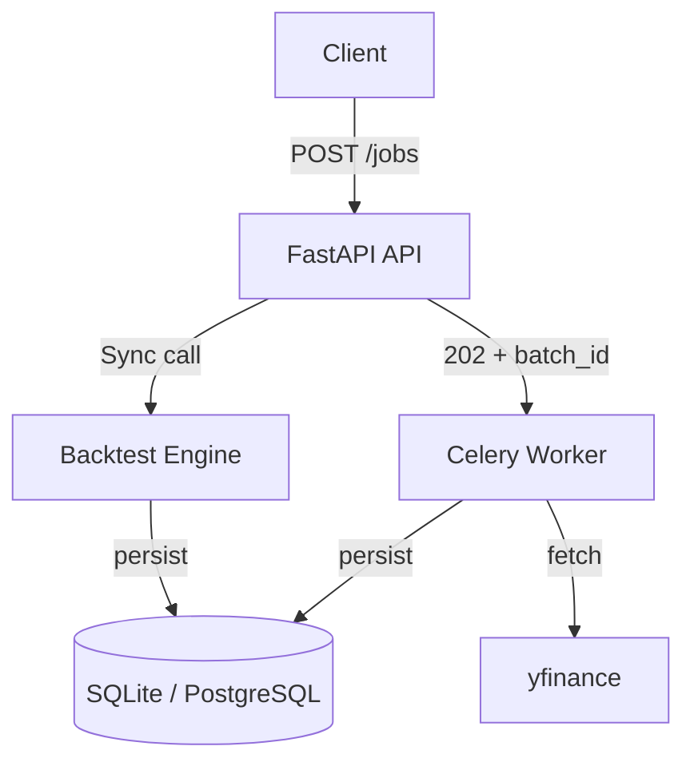

# Backgrid - Backtesting Engine

**Status**: **Phase 3 - Engineering Hardening COMPLETE** (2026-02-28)

**Goal**: Build a real backtesting platform from scratch, evolving from monolith to distributed system

**Repository**: https://github.com/Thinh-nguyen-03/backgrid

---

## Quick Start

```bash
# Clone repository
git clone https://github.com/Thinh-nguyen-03/backgrid
cd backgrid

# Install dependencies
pip install -r requirements.txt

# Build frontend
cd frontend && npm install && npm run build && cd ..

# Start server
uvicorn src.api:app --reload --port 8000
```

Open browser to http://localhost:8000

**For detailed setup, deployment, and configuration:** See [docs/SETUP.md](docs/SETUP.md)

---

## Features

### Architecture

```mermaid
graph TD
    A[Client] -->|POST /jobs| B[FastAPI API]
    B -->|Sync call| C[Backtest Engine]
    B -->|202 + batch_id| D[Celery Worker]
    C & D -->|persist| E[(SQLite / PostgreSQL)]
    D -->|fetch| F[yfinance]
```

### Features Implemented
- **Modern Web UI** (Vite + vanilla JS, Chart.js equity curves, brutalist design)
- **10+ REST API endpoints** including health probes, single/portfolio backtests, diff endpoint, trade ledger, strategy import
- **Async portfolio backtests** via Celery + Redis — POST returns 202 immediately, poll for completion
- **Backtest diff endpoint**: `GET /api/v1/backtest/diff?a=&b=` — parameter and metric deltas between two runs
- **Full DB persistence**: All jobs and portfolio results survive server restarts (SQLite or PostgreSQL)
- **Symbol browsing**: Browse 503 S&P 500 symbols organized by 11 GICS sectors with collapsible groups and search
- **Multiple trading strategies**:
  - MA Crossover with configurable periods
  - RSI mean reversion with 2-of-3 confirmation logic
  - Multi-strategy combination (OR, AND, PRIORITY, WEIGHTED)
- **Pluggable data loaders**: Yahoo Finance + PostgreSQL (RapidTrader) + S&P 500 (us500.com with Wikipedia fallback)
- **ATR-based position sizing** with volatility-adjusted risk
- **Transaction cost modeling**: commission, spread, slippage
- **Risk management**: market regime filter, ATR stop losses, sector limits, portfolio heat tracking
- **Structured JSON logging** with per-request UUID (`X-Request-ID` header)
- **Health check with dependency probes**: active DB + Redis ping, 503 on database failure
- **Centralized config** via Pydantic Settings (`src/config.py`)
- **Redis rate limiting** for LLM extraction (fail-open, survives restarts)
- **660+ passing unit tests** across all modules

### Performance (Measured)
- **Latency**: 2-3 seconds per backtest
- **Throughput**: ~20 jobs/minute (synchronous)
- **Data fetched**: 250 trading days in <3s
- **Test coverage**: 660 tests across all components (>95% on critical paths)
- **Signal calculation**: <10ms for 252 trading days
- **ATR calculation**: <5ms for 252 trading days
- **Position sizing**: <1ms per calculation

### Tech Stack
- **FastAPI** - Modern async web framework
- **Vite + Vanilla JS** - Frontend build tooling and component architecture
- **Chart.js** - Equity curve visualization
- **pandas** - Data manipulation and analysis
- **yfinance** - Market data provider (Yahoo Finance)
- **BeautifulSoup4** - HTML parsing for S&P 500 symbol data
- **SQLAlchemy + Alembic** - Database ORM and migrations (SQLite or PostgreSQL)
- **Celery + Redis** - Async task processing (Docker mode)
- **pytest** - Testing framework (660 tests)

---

## Testing

```bash
# Run all tests (650 tests, ~10 seconds)
pytest tests/ -v

# Run specific test file
pytest tests/test_rsi_strategy.py -v

# With coverage
pytest tests/ --cov=src --cov-report=html
```

**For detailed testing and development workflows:** See [docs/SETUP.md](docs/SETUP.md)

---

## Known Limitations (Current Phase)

- **No authentication** - Open API (single-user mode)
- **Frontend requires Node.js** - `npm install` and `npm run build` needed for the Web UI
- **Batch performance** - 500+ symbol portfolio target not yet validated at scale

These are **intentional** - Each phase adds complexity based on measured need.

---

## Project Structure

```
backgrid/
├── src/
│   ├── api.py              # FastAPI app, health probe, request ID middleware
│   ├── api_portfolio.py    # Portfolio, multi-strategy, diff endpoints
│   ├── api_extraction.py   # LLM strategy import (Redis rate-limited)
│   ├── config.py           # Pydantic Settings (single source of env config)
│   ├── logging_config.py   # JSON log formatter + configure_logging()
│   ├── backtest.py         # Core backtesting engine (legacy + enhanced)
│   ├── models.py           # Pydantic request/response models
│   ├── db.py               # SQLAlchemy models + CRUD helpers
│   ├── ui.py               # SPA serving from frontend/dist/
│   ├── worker.py           # Celery worker tasks
│   ├── sp500.py            # S&P 500 symbol data
│   ├── strategies/         # Pluggable strategy framework
│   ├── data/               # Pluggable data loaders
│   ├── position_sizing/    # Volatility-adjusted sizing
│   ├── execution/          # Order fill simulation
│   ├── risk/               # Portfolio risk controls
│   └── portfolio/          # Portfolio state, trade ledger, runner
├── frontend/
│   ├── src/
│   │   ├── index.html          # Main HTML shell
│   │   ├── main.js             # App entry point
│   │   ├── components/         # UI components (10 modules)
│   │   ├── styles/             # Modular CSS (BEM methodology)
│   │   ├── services/           # API client, storage, utils
│   │   ├── state/              # AppState manager
│   │   └── config/             # Constants and defaults
│   ├── dist/                   # Production build output
│   ├── package.json
│   └── vite.config.js
├── tests/                  # Test suite (660 tests)
├── docs/                   # Design docs and architecture
├── alembic/                # Database migrations
└── requirements.txt
```

---

## API Documentation

**Interactive API Docs**: http://localhost:8000/docs

**Key Endpoints:**
- `GET /api/v1/health` - Health check with DB + Redis probes
- `POST /api/v1/jobs` - Submit single-symbol backtest (synchronous)
- `POST /api/v1/backtest/portfolio` - Portfolio backtest (202 async)
- `GET /api/v1/backtest/diff?a=&b=` - Diff two portfolio runs
- `POST /api/v1/backtest/multi-strategy` - Multi-strategy combination
- `GET /api/v1/symbols` - List S&P 500 symbols by sector
- `POST /api/v1/strategy/import` - LLM-assisted strategy extraction

**For complete API documentation:** See [docs/API.md](docs/API.md)

---

## Documentation

**Core Documentation:**
- [SETUP.md](docs/SETUP.md) - Installation, deployment, configuration
- [ARCHITECTURE.md](docs/ARCHITECTURE.md) - System design and evolution plan
- [API.md](docs/API.md) - Complete API reference
- [DECISION_LOG.md](docs/DECISION_LOG.md) - Every major decision documented with measurements
- [STRATEGY_SDK.md](docs/STRATEGY_SDK.md) - Guide to implementing custom strategies
- [GLOSSARY.md](docs/GLOSSARY.md) - Technical terms and financial metrics
- [DATA_MODEL.md](docs/DATA_MODEL.md) - Database schema and entity relationships
- [CODING_STANDARDS.md](docs/CODING_STANDARDS.md) - Style guide and conventions
- [KNOWN_LIMITATIONS.md](docs/KNOWN_LIMITATIONS.md) - Current constraints and future plans

**Design Documents:**
- [STRATEGY_IMPORT_DESIGN.md](docs/STRATEGY_IMPORT_DESIGN.md) - Strategy preset library + LLM-assisted parameter extraction (Phase 2.5 design)

---

## What's Next

### Phase 4: Performance & Scale
**When**: After profiling shows specific bottlenecks or multiple users are needed
**What**: Go gRPC service for metrics, TimescaleDB for time-series, JWT auth
**Why**: Only add complexity when measurements prove it's needed

### Phase 4 Candidates
- **Go gRPC Metrics Service** - When metrics calculation >50% of runtime
- **TimescaleDB** - When PostgreSQL queries slow on 10M+ equity curve rows
- **JWT Authentication** - When multiple users need data isolation

See [docs/ARCHITECTURE.md](docs/ARCHITECTURE.md) for detailed evolution plan.

---

## Development Decisions

All major decisions are documented in [docs/DECISION_LOG.md](docs/DECISION_LOG.md) with:
- Problem being solved
- Alternatives considered
- Measurements/benchmarks
- Impact after implementation

Example decisions from Phase 1:
- FastAPI over Flask (better async support for future)
- In-memory storage over database (simplicity for MVP)
- yfinance over paid data (free, good enough for learning)
- MA crossover only (prove one strategy works first)

---

## Contributing

This is a **learning project** showing incremental system evolution. Feedback welcome!

**Please note:**
- Phase 1 is intentionally simple
- Future complexity will be added based on measured need
- Each phase is tagged in git history

---

## License

MIT

---

## Acknowledgments

Built to learn distributed systems through practical implementation.
