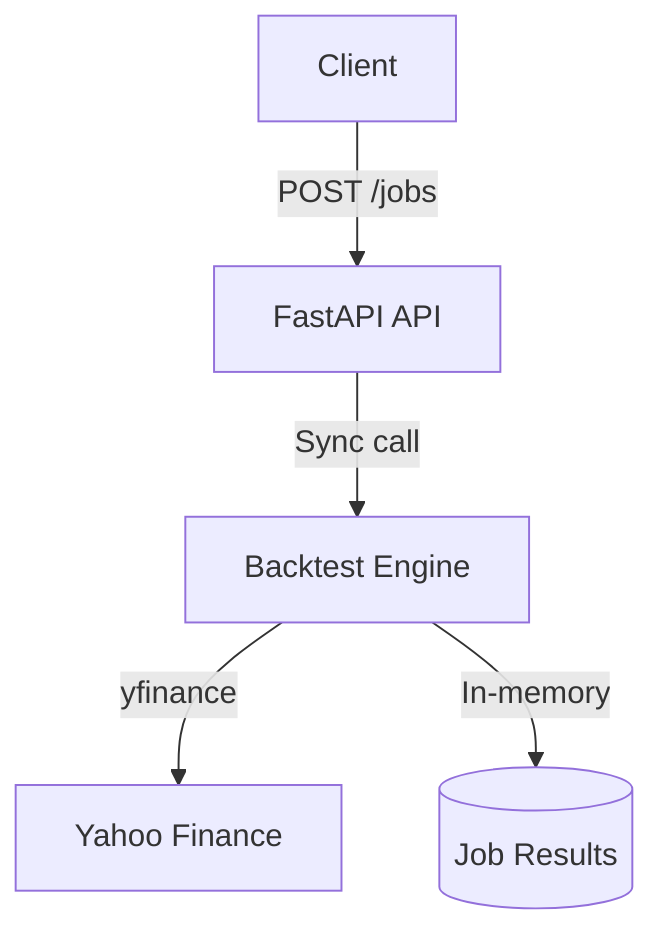

# Backgrid - Backtesting Engine

**Status**: **Phase 2 - Week 4 COMPLETE** (Risk Management)

**Goal**: Build a real backtesting platform from scratch, evolving from monolith to distributed system

**Repository**: https://github.com/Thinh-nguyen-03/backgrid

---

## Quick Start

```bash
# Clone and setup
git clone https://github.com/Thinh-nguyen-03/backgrid
cd backgrid
pip install -r requirements.txt

# Start the API
python src/api.py
```

### Web UI (Fastest Way)
Open browser to http://localhost:8000
- Fill in symbol, dates, MA parameters
- Click Submit → See JSON results instantly
- No build step, no npm, no framework

### API Usage (Alternative)

```bash
# MA Crossover Strategy
curl -X POST http://localhost:8000/api/v1/jobs \
  -H "Content-Type: application/json" \
  -d '{"symbol":"AAPL","strategy":"ma_crossover","params":{"fast":10,"slow":30},"start":"2023-01-01","end":"2023-12-31"}'

# RSI Strategy
curl -X POST http://localhost:8000/api/v1/jobs \
  -H "Content-Type: application/json" \
  -d '{"symbol":"AAPL","strategy":"rsi","params":{"rsi_period":14,"oversold_threshold":30,"overbought_threshold":55},"start":"2023-01-01","end":"2023-12-31"}'
```

**Example Response:**
```json
{
  "job_id": "manual-20251109-014101",
  "status": "completed",
  "sharpe": 0.7739,
  "max_drawdown": -0.1684,
  "total_return": 0.1111,
  "equity_curve": [10000, 10050, ...],
  "runtime_seconds": 2.66
}
```

---

## Phase 1 - What's Built

### Architecture

```mermaid
graph TD
    A[Client] -->|POST /jobs| B[FastAPI API]
    B -->|Sync call| C[Backtest Engine]
    C -->|yfinance| D[Yahoo Finance]
    C -->|In-memory| E[(Job Results)]
```

### Features Implemented
- **Simple HTML UI** (single file, zero dependencies, <30 lines)
- **3 REST API endpoints** (health, submit job, get job)
- **Multiple trading strategies**:
  - MA Crossover with configurable periods
  - RSI mean reversion with 2-of-3 confirmation logic
  - Multi-strategy combination (OR, AND, PRIORITY, WEIGHTED)
- **Pluggable data loaders**: Yahoo Finance + PostgreSQL (RapidTrader)
- **ATR-based position sizing** with volatility-adjusted risk
- **Transaction cost modeling**: commission, spread, slippage
- **Risk management**:
  - Market regime filter (SPY 200-SMA bull/bear detection)
  - ATR-based stop losses with cooldown periods
  - Sector concentration limits (30% max per sector)
  - Portfolio heat tracking (aggregate risk exposure)
- **Real market data** from Yahoo Finance or RapidTrader PostgreSQL
- **Performance metrics**: Sharpe ratio, max drawdown, total return, win rate
- **Full equity curves** and trade ledger
- **Comprehensive error handling** and validation
- **256 passing unit tests** across all modules
- **Automated smoke tests** for end-to-end verification

### Performance (Measured)
- **Latency**: 2-3 seconds per backtest
- **Throughput**: ~20 jobs/minute (synchronous)
- **Data fetched**: 250 trading days in <3s
- **Test coverage**: 256 tests across all components (>95% on critical paths)
- **Signal calculation**: <10ms for 252 trading days
- **ATR calculation**: <5ms for 252 trading days
- **Position sizing**: <1ms per calculation

### Tech Stack
- **FastAPI** - Modern async web framework
- **pandas** - Data manipulation and analysis
- **yfinance** - Market data provider (Yahoo Finance)
- **pytest** - Testing framework
- **In-memory storage** - Results stored during runtime

---

## Testing

### Run All Unit Tests
```bash
pytest tests/ -v
# 256 tests, ~4 seconds
```

### Run Smoke Tests
```bash
# Start API first: python src/api.py
python scripts/smoke_test.py
# Tests: health check, job submission, retrieval, error handling
```

### Manual Testing
```bash
# Web UI (simplest)
open http://localhost:8000

# Health check
curl http://localhost:8000/api/v1/health

# Interactive API docs
open http://localhost:8000/docs
```

---

## Known Limitations (Current Phase)

- **Synchronous execution** - Jobs block the API (no async workers yet)
- **In-memory storage** - Results lost when server restarts
- **No authentication** - Open API (single-user mode)
- **Basic UI** - Simple HTML form (no charts or advanced visualization)
- **Single-symbol backtests** - Portfolio aggregation across 500+ symbols planned for Week 5

These are **intentional** - Each phase adds complexity based on measured need.

---

## Project Structure

```
backgrid/
├── src/
│   ├── api.py              # FastAPI endpoints
│   ├── backtest.py         # Core backtesting engine (legacy + enhanced)
│   ├── models.py           # Pydantic request/response models
│   ├── ui.py               # Simple HTML UI
│   ├── strategies/         # Pluggable strategy framework
│   │   ├── base.py               # Abstract strategy interface
│   │   ├── ma_strategy.py        # Moving average crossover
│   │   ├── rsi_strategy.py       # RSI mean reversion
│   │   └── strategy_manager.py   # Multi-strategy orchestration
│   ├── data/               # Pluggable data loaders
│   │   ├── base_loader.py        # Abstract loader + caching
│   │   ├── yahoo_loader.py       # Yahoo Finance
│   │   ├── postgres_loader.py    # RapidTrader PostgreSQL
│   │   └── legacy.py             # Backward-compat fetch_ohlcv
│   ├── position_sizing/    # Volatility-adjusted sizing
│   │   ├── base_sizer.py         # Abstract interface
│   │   ├── atr_sizer.py          # ATR-based sizing
│   │   └── fixed_sizer.py        # Fixed fractional
│   ├── execution/          # Order fill simulation
│   │   ├── transaction_costs.py  # Commission/spread/slippage
│   │   └── order_simulator.py    # Fill logic
│   └── risk/               # Portfolio risk controls
│       ├── market_regime.py      # SPY 200-SMA bull/bear filter
│       ├── stop_loss.py          # ATR stops + cooldown
│       ├── sector_limits.py      # Sector concentration caps
│       └── portfolio_heat.py     # Aggregate risk tracking
├── tests/
│   ├── test_api.py             # API endpoint tests (19)
│   ├── test_backtest.py        # Backtest logic tests (32)
│   ├── test_data.py            # Legacy data tests (26)
│   ├── test_data_loaders.py    # Data loader tests (25)
│   ├── test_models.py          # Model validation tests (22)
│   ├── test_strategies.py      # Strategy framework tests (45)
│   ├── test_position_sizing.py # Position sizing tests (40)
│   ├── test_execution.py       # Execution tests (37)
│   └── test_risk.py            # Risk management tests (58)
├── scripts/
│   └── smoke_test.py       # Automated smoke tests
├── docs/                   # Design docs and architecture
└── requirements.txt
```

---

## API Documentation

### Endpoints

**Health Check**
```bash
GET /api/v1/health
# Returns: {"status": "ok", "phase": 1, "timestamp": "..."}
```

**Submit Backtest Job**
```bash
POST /api/v1/jobs
Content-Type: application/json

{
  "symbol": "AAPL",
  "strategy": "ma_crossover",
  "params": {"fast": 10, "slow": 30},
  "start": "2023-01-01",
  "end": "2023-12-31"
}

# Returns: Job results with metrics and equity curve
```

**Get Job Results**
```bash
GET /api/v1/jobs/{job_id}
# Returns: Same as POST response
```

**Interactive Docs**: http://localhost:8000/docs

---

## What's Next

### Phase 2 Week 5: Portfolio Aggregation
- Portfolio state tracker across multiple symbols
- Trade ledger with strategy attribution
- Celery workers for parallel 500+ symbol backtests

### Phase 2 Week 6-7: API Extensions + Validation
- Portfolio backtest endpoints
- Alembic migrations for result persistence
- Validation against RapidTrader historical performance

### Phase 3: Performance & Scale
**When**: After profiling shows specific bottlenecks
**What**: Go gRPC service for metrics, TimescaleDB for time-series, JWT auth
**Why**: Only add complexity when measurements prove it's needed

See [docs/ARCHITECTURE.md](docs/ARCHITECTURE.md) for detailed evolution plan.

---

## Development Decisions

All major decisions are documented in [docs/DECISION_LOG.md](docs/DECISION_LOG.md) with:
- Problem being solved
- Alternatives considered
- Measurements/benchmarks
- Impact after implementation

Example decisions from Phase 1:
- FastAPI over Flask (better async support for future)
- In-memory storage over database (simplicity for MVP)
- yfinance over paid data (free, good enough for learning)
- MA crossover only (prove one strategy works first)

---

## Contributing

This is a **learning project** showing incremental system evolution. Feedback welcome!

**Please note:**
- Phase 1 is intentionally simple
- Future complexity will be added based on measured need
- Each phase is tagged in git history

---

## License

MIT

---

## Acknowledgments

Built to learn distributed systems through practical implementation.
