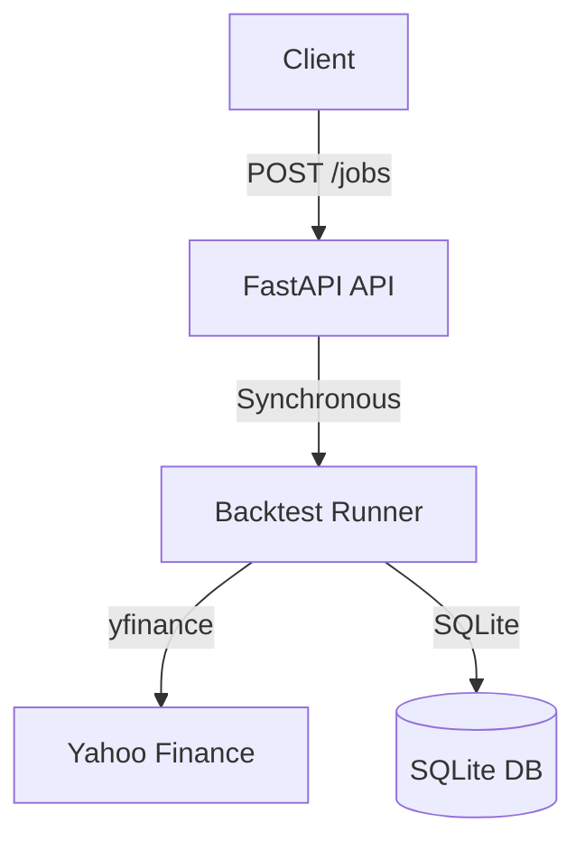
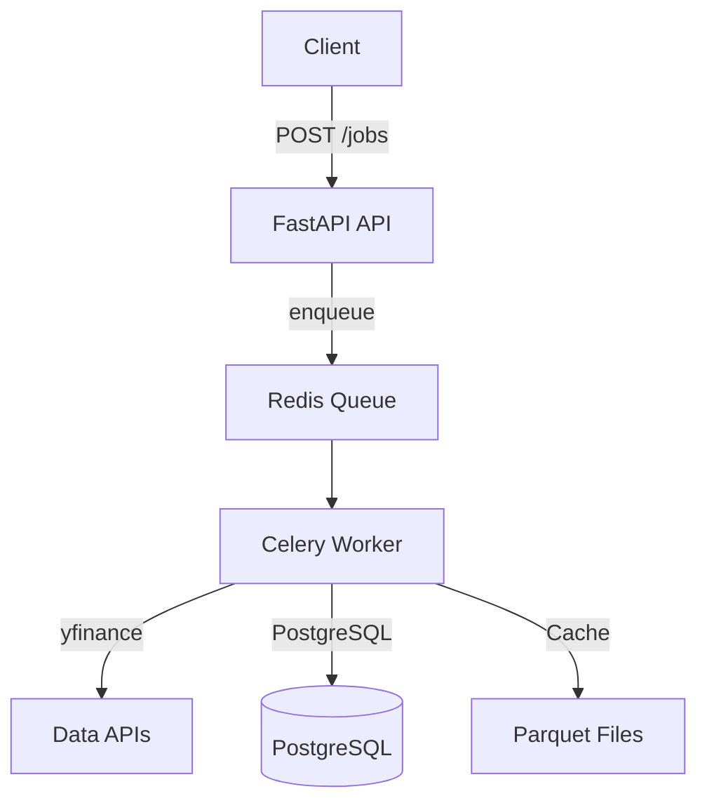
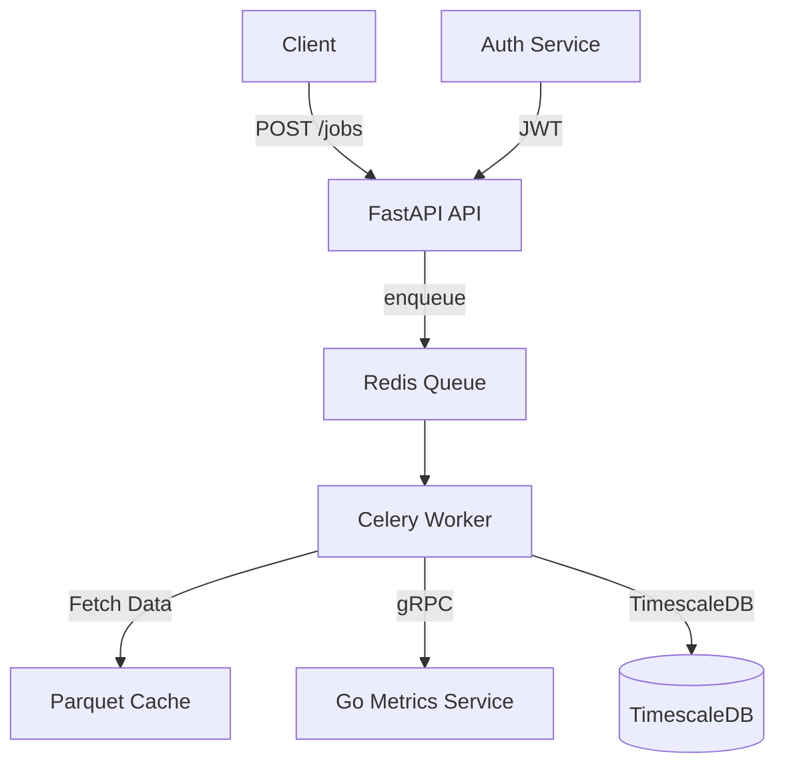

# Architecture

## Phase 1: Monolith (Current)

**Stack**: FastAPI + SQLite + pandas + yfinance

**Runtime**: Single Python process, synchronous

**Goal**: Prove core logic works end-to-end

### Components:
- **API**: Single endpoint `POST /api/v1/jobs` (synchronous)
- **DB**: SQLite file `backgrid.db` (no migrations yet)
- **Data**: Direct yfinance calls (no caching)
- **Testing**: Manual curl requests

### Performance:
- **Throughput**: ~10 jobs/minute (synchronous)
- **Latency**: 2-8s per job (depends on data size)
- **Limitation**: API blocks on long-running jobs

**Git Tag**: `phase-1-mvp`

---

## Phase 2: Async Workers (Planned)

**Trigger**: Jobs consistently >5s, causing HTTP timeouts

**Stack Additions**: Celery + Redis + PostgreSQL

### Changes:
- **API** becomes non-blocking: Returns `job_id` immediately
- **Workers**: 2-4 Celery processes execute jobs
- **DB**: Migrate SQLite → PostgreSQL for concurrent writes
- **Cache**: Add Parquet cache for OHLCV data

### Performance Target:
- **Throughput**: 10+ jobs/sec with 4 workers
- **Latency**: <2s per job (cached data)

**Complexity Receipt**: Will be documented in [DECISION_LOG.md](DECISION_LOG.md) when triggered

**Git Tag**: `phase-2-async`

---

## Phase 3: Performance & Scale (Future)

**Trigger**: Parameter sweeps show metrics calculation >50% of runtime AND/OR database queries on 25M+ rows are slow AND/OR multiple users need isolation

**Stack Additions**: Go gRPC service + TimescaleDB + JWT Auth

### Changes:
- **Metrics service**: Go gRPC for Sharpe/Sortino/MaxDD (5-10x speedup expected)
- **DB**: Equity curves → TimescaleDB hypertable
- **Auth**: JWT tokens, user isolation in DB

### Performance Targets:
- **Metrics calculation**: <100ms per job
- **Query latency**: <500ms on 100M rows
- **Support**: 5+ concurrent users

**Complexity Receipts**: Will be documented for each addition

**Git Tag**: `phase-3-scaled`

---

## Core Principles

1. **No technology added without a trigger**: Each phase solves a measured problem
2. **Keep receipts**: Every major decision documented in [DECISION_LOG.md](DECISION_LOG.md)
3. **Git history shows evolution**: Tags for each phase, commits show incremental changes
4. **README always honest**: Status badge reflects current phase
