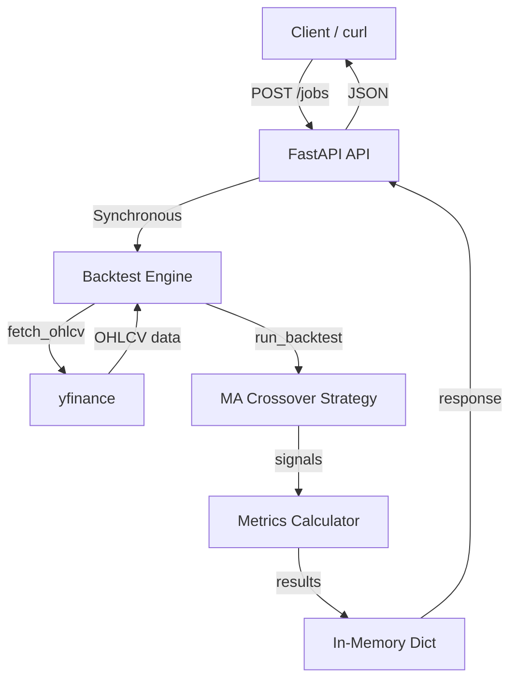
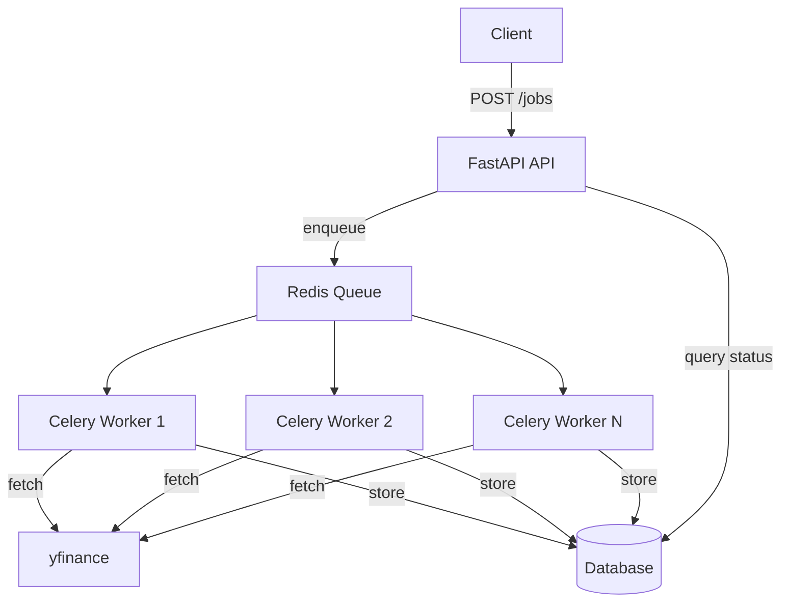
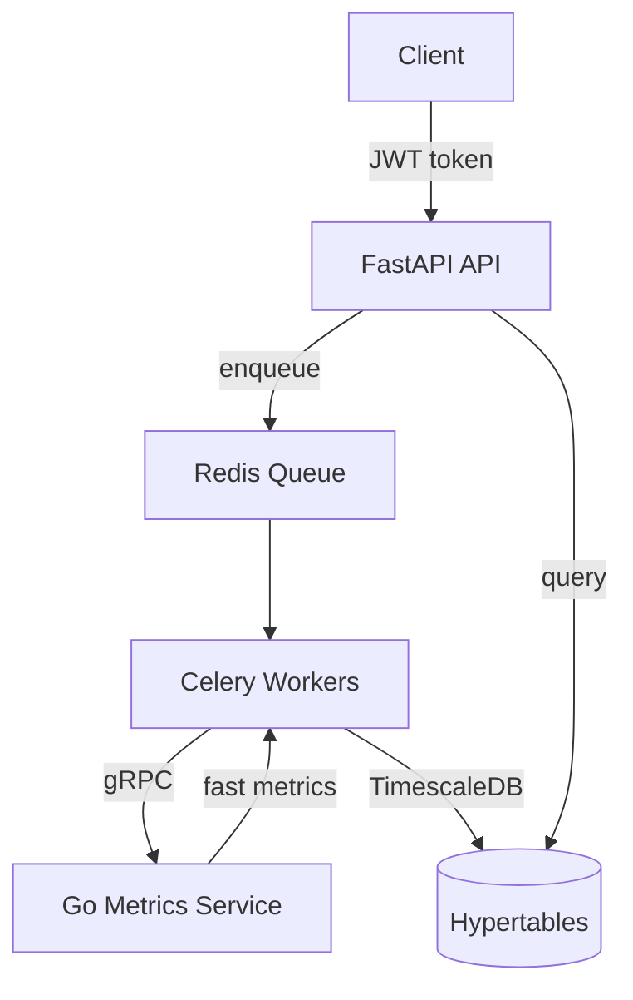

# Architecture

## Phase 1: MVP (COMPLETE)

**Status**: Fully implemented and tested

**Stack**: FastAPI + In-Memory Storage + pandas + yfinance

**Runtime**: Single Python process, synchronous execution

**Goal**: Prove core backtesting logic works end-to-end



### Components

#### API Layer ([src/api.py](../src/api.py))
- **FastAPI application** with 3 endpoints
- **Health check**: `GET /api/v1/health`
- **Submit job**: `POST /api/v1/jobs` (synchronous, returns immediately)
- **Get job**: `GET /api/v1/jobs/{job_id}`
- **Storage**: In-memory dictionary (`job_results`)
- **Error handling**: HTTP 400/422/500 with clear messages
- **Logging**: INFO level for all requests

#### Data Layer ([src/data.py](../src/data.py))
- **fetch_ohlcv()**: Downloads OHLCV data from Yahoo Finance
- **Validation**: Checks for sufficient data, NaN values, valid columns
- **Error handling**: Custom `DataFetchError` for data issues
- **No caching**: Re-fetches from Yahoo every time

#### Backtest Engine ([src/backtest.py](../src/backtest.py))
- **calculate_ma_crossover_signals()**: Generate buy/sell signals
- **calculate_returns()**: Build equity curve from signals
- **calculate_sharpe_ratio()**: Annualized Sharpe ratio
- **calculate_max_drawdown()**: Maximum drawdown percentage
- **calculate_total_return()**: Total return percentage
- **run_backtest()**: Orchestrates full backtest execution

#### Models ([src/models.py](../src/models.py))
- **Pydantic models** for request/response validation
- **BacktestRequest**: Validates symbol, strategy, params, dates
- **BacktestResponse**: Structures results with metrics
- **Enums**: StrategyType, JobStatus

### Performance (Measured)

**Test Case**: AAPL 2023 (250 trading days)
- **Latency**: 2.66s (data fetch + backtest + metrics)
- **Throughput**: ~20 jobs/minute (synchronous)
- **Memory**: <100MB per job
- **Tests**: 99/99 passing in <2s

**Breakdown**:
- Data fetch from yfinance: ~2s
- MA crossover signals: <0.1s
- Metrics calculation: <0.1s
- JSON serialization: <0.1s

### Testing Strategy

**Unit Tests (99 total)**:
- 22 tests: Model validation
- 26 tests: Data fetching
- 32 tests: Backtest logic
- 19 tests: API endpoints

**Smoke Tests (5 total)**:
- Health check
- Job submission
- Job retrieval
- Invalid symbol handling
- Parameter validation

**Coverage**: Critical path coverage >95%

### Limitations (By Design)

1. **Synchronous execution**: Jobs block the API thread
   - Impact: Can't process multiple jobs concurrently
   - Why acceptable: 2-3s latency is fast enough for MVP

2. **In-memory storage**: Results lost on restart
   - Impact: Can't query historical backtests
   - Why acceptable: Developing/testing, don't need persistence yet

3. **No data caching**: Re-fetches from Yahoo every time
   - Impact: Slightly slower for repeated symbols
   - Why acceptable: 2s data fetch is acceptable, no rate limit issues

4. **Single strategy**: Only MA crossover implemented
   - Impact: Can't test other strategies
   - Why acceptable: Better to prove one strategy works perfectly

5. **No authentication**: Open API
   - Impact: Anyone with access can submit jobs
   - Why acceptable: Single-user development mode

### Deployment

**Development**:
```bash
python src/api.py
# Server runs on http://localhost:8000
```

**Testing**:
```bash
pytest tests/  # Unit tests
python scripts/smoke_test.py  # Smoke tests
```

**Git Tag**: `phase-1-mvp`

---

## Phase 2: Async Workers (PLANNED)

**Trigger**: One of these conditions:
- HTTP timeouts >30s occurring regularly
- Throughput requirement >5 jobs/sec
- Multiple concurrent users needed

**Stack Additions**: Celery + Redis + Database



### Changes from Phase 1

**API Layer**:
- `POST /jobs` returns immediately with job_id and status="queued"
- Add `GET /jobs/{job_id}/status` to poll job status
- Non-blocking: multiple requests can be processed

**Workers**:
- Celery workers process jobs asynchronously
- Configurable number of workers (2-4 initially)
- Each worker runs `run_backtest()` independently

**Database**:
- PostgreSQL for concurrent writes
- Tables: `jobs`, `results`, `equity_curves`
- NOT SQLite (not suitable for concurrent access)

**Data Caching** (if needed):
- Parquet files for OHLCV data: `data/cache/{symbol}_{start}_{end}.parquet`
- Cache hit: <0.1s, Cache miss: ~2s
- LRU eviction after 100 symbols

### Performance Targets

- **Throughput**: 10+ jobs/sec with 4 workers
- **Latency**: <2s per job (with cache hit)
- **Queue time**: <1s to dequeue
- **API response**: <100ms to enqueue

### Complexity Receipt Required

Before implementing Phase 2, document in DECISION_LOG.md:
- Measurement showing current system is bottleneck
- Benchmark of synchronous vs async
- Expected improvement metrics

---

## Phase 3: Performance & Scale (FUTURE)

**Triggers** (any of these):
- Profiler shows metrics calculation >50% of runtime
- Database queries >500ms on 10M+ rows
- Multiple users need data isolation

**Stack Additions**: Go gRPC + TimescaleDB + JWT Auth



### Potential Additions (Only If Needed)

**Go gRPC Metrics Service**:
- Parallel calculation of Sharpe/Sortino/MaxDD
- Expected 5-10x speedup over Python
- Only if profiler proves metrics are bottleneck

**TimescaleDB**:
- Hypertables for equity curves and prices
- Automatic partitioning by time
- Only if PostgreSQL queries slow on large datasets

**JWT Authentication**:
- User isolation in database
- API rate limiting per user
- Only if multiple users need the platform

### Complexity Receipts Required

Each addition requires:
- Profiler output or benchmark showing bottleneck
- Comparison of alternatives
- Before/after metrics

---

## Core Principles

1. **No technology without a trigger**: Complexity must be justified by measurements
2. **Start simple**: Phase 1 proves the logic works
3. **Evolve based on need**: Add features only when current system shows limits
4. **Document decisions**: Every change recorded in DECISION_LOG.md
5. **Git history shows evolution**: Tags for each phase
6. **Be honest in README**: Status reflects current implementation, not aspirations
