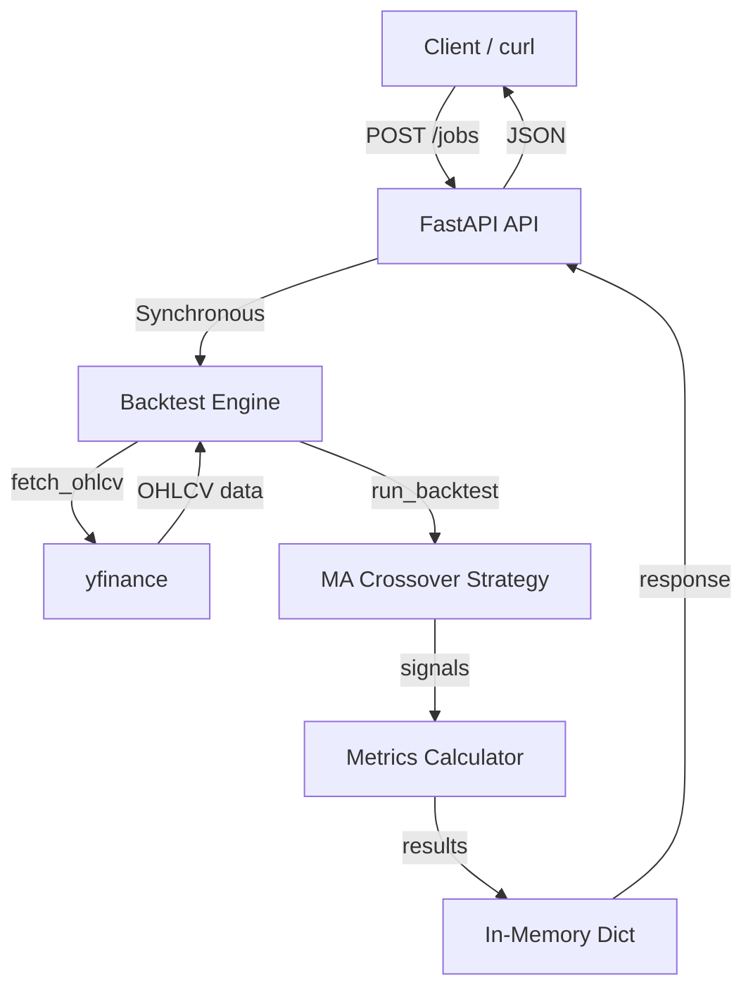
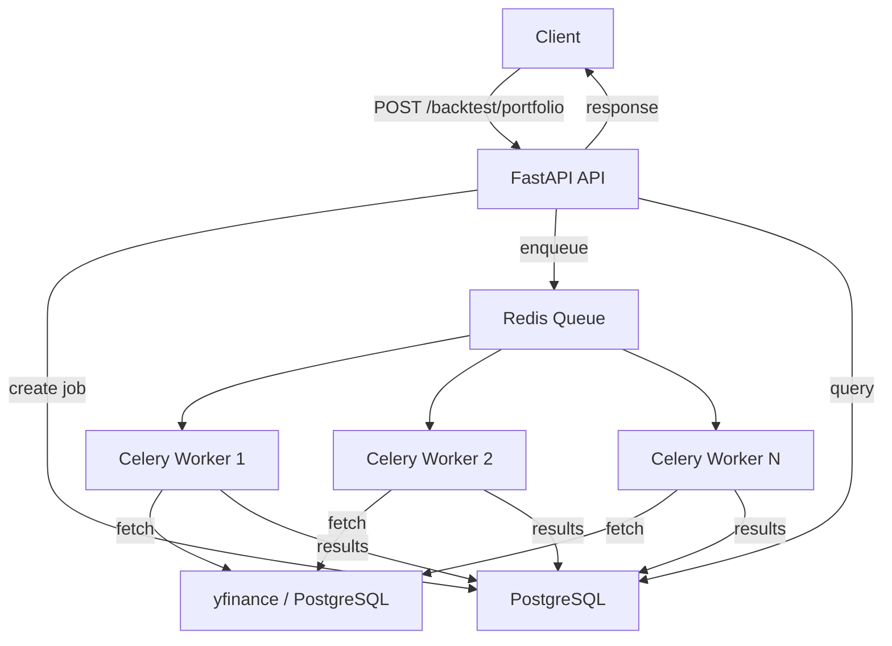
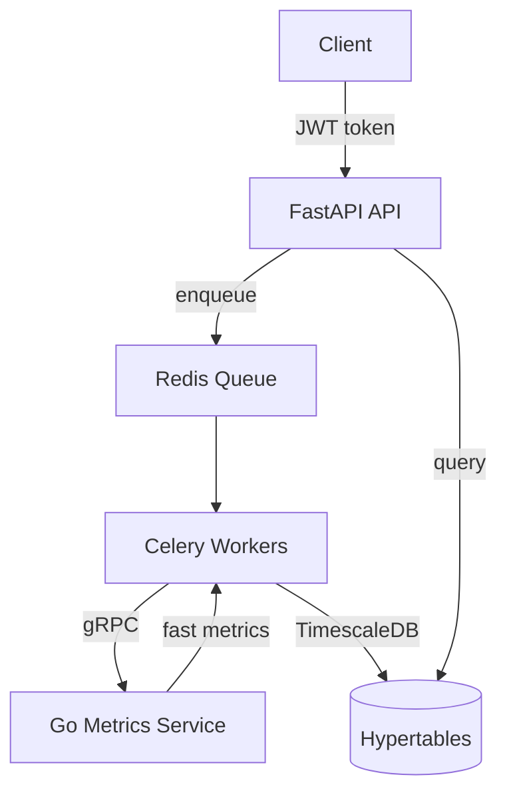

# Architecture

## Phase 1: MVP (COMPLETE)

**Status**: Fully implemented and tested

**Stack**: FastAPI + In-Memory Storage + pandas + yfinance

**Runtime**: Single Python process, synchronous execution

**Goal**: Prove core backtesting logic works end-to-end


```mermaid
graph TD
    A[Client / curl] -->|POST /jobs| B[FastAPI API]
    B -->|Synchronous| C[Backtest Engine]
    C -->|fetch_ohlcv| D[yfinance]
    D -->|OHLCV data| C
    C -->|run_backtest| E[MA Crossover Strategy]
    E -->|signals| F[Metrics Calculator]
    F -->|results| G[In-Memory Dict]
    G -->|response| B
    B -->|JSON| A
```

### Components

#### API Layer ([src/api.py](../src/api.py))
- **FastAPI application** with 8 endpoints (3 legacy + 5 new)
- **Health check**: `GET /api/v1/health`
- **Submit job**: `POST /api/v1/jobs` (synchronous, returns immediately)
- **Get job**: `GET /api/v1/jobs/{job_id}`
- **Portfolio backtest**: `POST /api/v1/backtest/portfolio`
- **Get portfolio**: `GET /api/v1/backtest/portfolio/{batch_id}`
- **Get trades**: `GET /api/v1/backtest/portfolio/{batch_id}/trades`
- **Multi-strategy**: `POST /api/v1/backtest/multi-strategy`
- **List symbols**: `GET /api/v1/symbols`
- **Storage**: PostgreSQL for portfolio results, in-memory for single jobs
- **Error handling**: HTTP 400/404/422/500 with clear messages
- **Logging**: INFO level for all requests

#### Data Layer ([src/data/](../src/data/))
- **BaseDataLoader**: Abstract interface for all data sources
- **YahooDataLoader**: Yahoo Finance implementation with caching
- **PostgresDataLoader**: RapidTrader database integration
- **Legacy functions**: `fetch_ohlcv()`, `validate_data()` for backward compatibility
- **Caching**: In-memory with configurable TTL (default 1 hour)
- **Connection pooling**: SQLAlchemy QueuePool for PostgreSQL

#### Backtest Engine ([src/backtest.py](../src/backtest.py))
- **calculate_ma_crossover_signals()**: Generate buy/sell signals
- **calculate_returns()**: Build equity curve from signals
- **calculate_sharpe_ratio()**: Annualized Sharpe ratio
- **calculate_max_drawdown()**: Maximum drawdown percentage
- **calculate_total_return()**: Total return percentage
- **run_backtest()**: Orchestrates full backtest execution (legacy)
- **run_backtest_enhanced()**: Advanced backtest with position sizing and transaction costs

#### Strategy Layer ([src/strategies/](../src/strategies/))
- **BaseStrategy**: Abstract interface for all strategies
- **MAStrategy**: Moving average crossover (refactored from backtest.py)
- **RSIStrategy**: RSI mean reversion with 2-of-3 confirmation
- **StrategyManager**: Multi-strategy orchestration with combination methods

#### Position Sizing ([src/position_sizing/](../src/position_sizing/))
- **BasePositionSizer**: Abstract interface for position sizing
- **ATRSizer**: ATR-based volatility sizing (RapidTrader compatible)
- **FixedFractionalSizer**: Fixed percentage of equity

#### Execution ([src/execution/](../src/execution/))
- **TransactionCostModel**: Commission, spread, slippage modeling
- **OrderSimulator**: Fill simulation with configurable logic (next_open, close, vwap)

#### Risk Management ([src/risk/](../src/risk/))
- **MarketRegimeFilter**: SPY 200-SMA bull/bear detection; blocks new long entries in bear markets
- **StopLossManager**: ATR-based stop prices with configurable cooldown after trigger
- **SectorLimitManager**: Enforces max exposure per sector (default 30%); supports per-sector overrides
- **PortfolioHeatTracker**: Tracks aggregate capital at risk; status levels COOL/WARM/HOT/CRITICAL

#### Portfolio Module ([src/portfolio/](../src/portfolio/))
- **PortfolioStateTracker**: Manages positions, cash, sector exposures, realized/unrealized P&L across multiple symbols
- **TradeLedger**: Records all trades with filtering by symbol, strategy, date range; generates summaries
- **Metrics**: Extended metrics including Sortino ratio, Calmar ratio, annualized returns, profit factor

#### Celery Workers ([src/worker.py](../src/worker.py))
- **run_single_backtest**: Task for single-symbol backtest with retry logic
- **run_portfolio_backtest**: Batch coordinator using Celery group for parallel execution
- **aggregate_results**: Combines results from multiple symbol backtests

#### Database Layer ([src/db.py](../src/db.py))
- **Job**: Single backtest job metadata
- **Result**: Single backtest results
- **PortfolioResult**: Portfolio batch metadata and aggregated metrics
- **SymbolResult**: Per-symbol results within a portfolio
- **TradeLedgerEntry**: Individual trade records with P&L tracking

#### Models ([src/models.py](../src/models.py))
- **Pydantic models** for request/response validation
- **BacktestRequest**: Validates symbol, strategy, params, dates
- **BacktestResponse**: Structures results with metrics
- **PortfolioBacktestRequest**: Multi-symbol batch request
- **PortfolioBacktestResponse**: Aggregated portfolio metrics
- **MultiStrategyRequest**: Combined strategy configuration
- **Enums**: StrategyType, JobStatus, CombinationMethodType

### Performance (Measured)

**Test Case**: AAPL 2023 (250 trading days)
- **Latency**: 2.66s (data fetch + backtest + metrics)
- **Throughput**: ~20 jobs/minute (synchronous)
- **Memory**: <100MB per job
- **Tests**: 380+ passing

**Breakdown**:
- Data fetch from yfinance: ~2s
- MA crossover signals: <0.1s
- Metrics calculation: <0.1s
- JSON serialization: <0.1s

### Testing Strategy

**Unit Tests (380+ total)**:
- 22 tests: Model validation
- 26 tests: Data fetching (legacy)
- 25 tests: Data loaders (new)
- 32 tests: Backtest logic
- 45 tests: Strategy framework
- 40 tests: Position sizing
- 37 tests: Execution module
- 58 tests: Risk management
- 65+ tests: Portfolio module
- 19 tests: API endpoints (legacy)
- 30+ tests: Portfolio API endpoints (Week 6)

**Smoke Tests (5 total)**:
- Health check
- Job submission
- Job retrieval
- Invalid symbol handling
- Parameter validation

**Coverage**: Critical path coverage >95%

### Limitations (By Design)

1. **Synchronous execution for portfolio**: Jobs block the API thread
   - Impact: Large portfolios may timeout
   - Mitigation: Use Celery workers for async execution

2. **In-memory storage for single jobs**: Results lost on restart
   - Impact: Can't query historical single backtests
   - Mitigation: Portfolio results persisted to PostgreSQL

3. **No authentication**: Open API
   - Impact: Anyone with access can submit jobs
   - Why acceptable: Single-user development mode

### Deployment

**Development**:
```bash
python src/api.py
```

**Testing**:
```bash
pytest tests/
python scripts/smoke_test.py
```

**Git Tag**: `phase-1-mvp`

---

## Phase 2: Async Workers (COMPLETE)

**Status**: Week 6 Complete - Portfolio API and database persistence implemented

**Stack**: FastAPI + Celery + Redis + PostgreSQL + pandas + yfinance

**Runtime**: Multi-worker parallel execution via Celery


```mermaid
graph TD
    A[Client] -->|POST /backtest/portfolio| B[FastAPI API]
    B -->|create job| C[PostgreSQL]
    B -->|enqueue| D[Redis Queue]
    D --> E1[Celery Worker 1]
    D --> E2[Celery Worker 2]
    D --> E3[Celery Worker N]
    E1 & E2 & E3 -->|fetch| F[yfinance / PostgreSQL]
    E1 & E2 & E3 -->|results| C
    B -->|query| C
    B -->|response| A
```

### Week 6 Implementation (COMPLETE)

#### Portfolio API ([src/api_portfolio.py](../src/api_portfolio.py))
- **POST /api/v1/backtest/portfolio**: Submit portfolio backtest with multiple symbols
- **GET /api/v1/backtest/portfolio/{batch_id}**: Retrieve portfolio results
- **GET /api/v1/backtest/portfolio/{batch_id}/trades**: Query trade ledger with filtering
- **POST /api/v1/backtest/multi-strategy**: Run multiple strategies on single symbol
- **GET /api/v1/symbols**: List available symbols from Yahoo or PostgreSQL

#### Database Tables
- **portfolio_results**: Batch metadata, aggregated metrics, status tracking
- **symbol_results**: Per-symbol results linked to batch
- **trade_ledger**: Individual trades with P&L, filtering support

#### Features
- Synchronous execution with database persistence
- Per-symbol results tracking with error handling
- Trade ledger with symbol/strategy filtering
- Pagination support for large result sets
- Multi-strategy signal combination (OR, AND, PRIORITY, WEIGHTED)

### Week 5 Implementation (COMPLETE)

#### Celery Workers ([src/worker.py](../src/worker.py))
- **run_single_backtest**: Task with max 3 retries, 5s retry delay
- **run_portfolio_backtest**: Batch coordinator using Celery group for parallel dispatch
- **aggregate_results**: Combines multi-symbol results into portfolio metrics
- **health_check**: Worker monitoring task
- **Configuration**: Redis broker at localhost:6379/0, JSON serialization, UTC timezone
- **Windows Compatibility**: Uses threads pool on Windows (prefork has Python 3.13 issues)

#### Portfolio Module ([src/portfolio/](../src/portfolio/))
- **PortfolioStateTracker**: Manages positions, cash, sector exposures, realized/unrealized P&L
- **TradeLedger**: Records all trades with filtering by symbol, strategy, date range
- **Extended Metrics**: Sortino ratio, Calmar ratio, profit factor, expectancy, payoff ratio

### Performance (Measured)

**Test Case**: 3-symbol portfolio backtest
- **Total runtime**: ~8s (including data fetch)
- **Database write**: <100ms per symbol
- **Trade ledger query**: <50ms with filtering

**Test Case**: Health check task
- **Task dispatch**: <50ms
- **Worker startup**: ~2s (threads pool on Windows)
- **Result retrieval**: <100ms

---

## Phase 3: Performance & Scale (FUTURE)

**Triggers** (any of these):
- Profiler shows metrics calculation >50% of runtime
- Database queries >500ms on 10M+ rows
- Multiple users need data isolation

**Stack Additions**: Go gRPC + TimescaleDB + JWT Auth


```mermaid
graph TD
    A[Client] -->|JWT token| B[FastAPI API]
    B -->|enqueue| C[Redis Queue]
    C --> D[Celery Workers]
    D -->|gRPC| E[Go Metrics Service]
    E -->|fast metrics| D
    D -->|TimescaleDB| F[(Hypertables)]
    B -->|query| F
```

### Potential Additions (Only If Needed)

**Go gRPC Metrics Service**:
- Parallel calculation of Sharpe/Sortino/MaxDD
- Expected 5-10x speedup over Python
- Only if profiler proves metrics are bottleneck

**TimescaleDB**:
- Hypertables for equity curves and prices
- Automatic partitioning by time
- Only if PostgreSQL queries slow on large datasets

**JWT Authentication**:
- User isolation in database
- API rate limiting per user
- Only if multiple users need the platform

### Complexity Receipts Required

Each addition requires:
- Profiler output or benchmark showing bottleneck
- Comparison of alternatives
- Before/after metrics

---

## Core Principles

1. **No technology without a trigger**: Complexity must be justified by measurements
2. **Start simple**: Phase 1 proves the logic works
3. **Evolve based on need**: Add features only when current system shows limits
4. **Document decisions**: Every change recorded in DECISION_LOG.md
5. **Git history shows evolution**: Tags for each phase
6. **Be honest in README**: Status reflects current implementation, not aspirations
