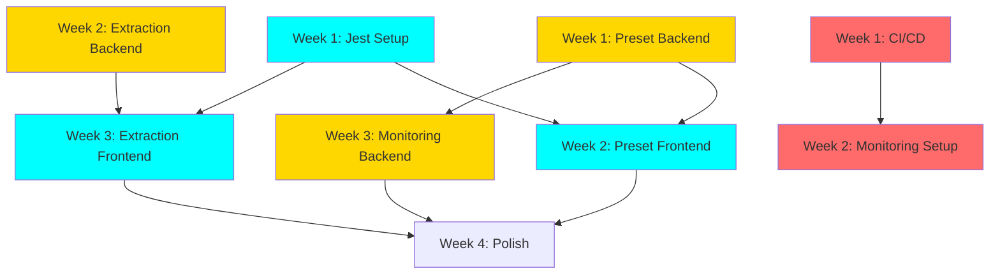

# Parallel Implementation Plan

**Goal**: Implement Strategy Import (Phase A+B) alongside Frontend Testing and Production Monitoring

**Timeline**: 3-4 weeks with parallel tracks

**Team Size**: 2-3 engineers (can scale up/down)

---

## Resource Allocation

### Track 1: Backend Engineering (1 engineer, full-time)

**Week 1: Strategy Presets Backend**
- PresetLibrary class implementation
- Pydantic models and validation
- Create 10 initial preset configs
- API endpoints (`/api/v1/presets`)
- 30+ backend tests
- **Deliverable**: Preset API functional

**Week 2: LLM Extraction Backend**
- StrategyExtractor class
- Content fetchers (GitHub, PDF)
- LLM prompt engineering
- Claude API integration
- Confidence scoring algorithm
- 40+ backend tests
- **Deliverable**: Extraction service functional

**Week 3: Monitoring Backend**
- Prometheus metrics endpoint (`/metrics`)
- Enhanced health check with dependencies
- Structured logging improvements
- Database query performance logging
- **Deliverable**: Monitoring instrumentation complete

**Week 4: Polish & Integration**
- Bug fixes from testing
- Performance optimization
- Documentation updates
- Production readiness review

---

### Track 2: Frontend Engineering (1 engineer, full-time)

**Week 1: Jest Testing Framework**
- Jest + Testing Library setup
- Configure test environment
- Mock API client
- Write component render tests
- Target: 50% coverage baseline
- **Deliverable**: Test framework operational

**Week 2: Strategy Presets Frontend**
- PresetSelector component
- Category filtering UI
- Preset card design
- Preview modal
- CSS styling (brutalist aesthetic)
- Integration with main app
- 20+ frontend tests
- **Deliverable**: Preset UI complete

**Week 3: LLM Extraction Frontend**
- StrategyImportWizard component
- 4-step wizard flow
- File upload handling
- Progress animations
- Review/edit interface
- 25+ frontend tests
- **Deliverable**: Import wizard complete

**Week 4: Frontend Testing Completion**
- Increase coverage to 60-70%
- End-to-end tests
- Integration tests
- Visual regression tests (optional)
- **Deliverable**: Comprehensive test suite

---

### Track 3: DevOps/Infrastructure (1 engineer, part-time ~50%)

**Week 1: CI/CD Pipeline**
- GitHub Actions workflow
- Run tests on PR
- Build Docker image on merge
- Deploy to staging automation
- **Deliverable**: Automated CI/CD

**Week 2: Monitoring Setup**
- Grafana dashboard setup
- Prometheus configuration
- Alert rules definition
- Log aggregation (optional)
- **Deliverable**: Monitoring dashboards live

**Week 3-4: Production Deployment**
- Production deployment guide
- SSL/TLS configuration docs
- Backup/restore procedures
- Performance testing
- **Deliverable**: Production-ready deployment

---

## Parallel Work Gantt Chart

```
Week 1:
Backend:    [████████] Preset Backend
Frontend:   [████████] Jest Setup + Tests
DevOps:     [████████] CI/CD Pipeline

Week 2:
Backend:    [████████] Extraction Backend
Frontend:   [████████] Preset Frontend
DevOps:     [████████] Monitoring Setup

Week 3:
Backend:    [████████] Monitoring Backend
Frontend:   [████████] Extraction Frontend
DevOps:     [████]     Production Docs

Week 4:
Backend:    [████]     Polish
Frontend:   [████████] Test Coverage++
DevOps:     [████]     Performance Testing

Legend:
████████ = Full time (40 hours)
████     = Half time (20 hours)
```

---

## Dependency Graph



**Key:**
- 🟡 Yellow: Backend work
- 🔵 Cyan: Frontend work
- 🔴 Red: DevOps work

---

## Conflict Avoidance Strategy

### Potential Conflicts

1. **Merge conflicts in `src/api.py`**
   - **Issue**: Adding multiple routers simultaneously
   - **Mitigation**:
     - Add preset router in Week 1
     - Add extraction router in Week 2 (sequential)
     - Use separate files (`api_presets.py`, `api_extraction.py`)

2. **Test suite runtime**
   - **Issue**: 660 tests → 750+ tests (15% increase)
   - **Mitigation**:
     - Parallel test execution in CI
     - Test categorization (unit, integration, e2e)
     - Selective test runs during development

3. **Frontend component conflicts**
   - **Issue**: Multiple developers editing same components
   - **Mitigation**:
     - New components in separate files
     - Minimal changes to existing components
     - Feature flags for work-in-progress features

4. **Documentation updates**
   - **Issue**: Multiple people updating docs
   - **Mitigation**:
     - Each feature owns its doc section
     - Weekly doc sync meeting
     - Use separate markdown files

### Communication Cadence

**Daily:**
- Standup (15 min): Progress, blockers, conflicts
- Slack updates on completed work

**Weekly:**
- Sprint planning (1 hour): Review previous week, plan next
- Code review sessions (1 hour): Review PRs together
- Documentation sync (30 min): Ensure docs are current

**As-needed:**
- Pair programming for complex features
- Architecture discussions for design decisions

---

## Testing Strategy

### Backend Tests (90+ new tests)

**Phase A: Presets (30 tests)**
- Preset loading and validation
- API endpoint responses
- Category filtering
- Preset compatibility checking

**Phase B: Extraction (40 tests)**
- LLM extraction accuracy
- Content fetching (GitHub, PDF)
- Confidence scoring
- Similarity matching
- API endpoint validation

**Monitoring (20 tests)**
- Metrics endpoint format
- Health check with dependencies
- Performance logging

### Frontend Tests (45+ new tests)

**Jest Setup (baseline)**
- Component render tests
- API client mocking
- State management tests
- Utility function tests

**Phase A: Presets (20 tests)**
- PresetSelector component rendering
- Category filtering
- Preset loading flow
- Preview modal

**Phase B: Extraction (25 tests)**
- ImportWizard multi-step flow
- File upload handling
- Extraction progress UI
- Review/edit interface

---

## Risk Management

### High-Risk Items

1. **LLM extraction accuracy <85%**
   - **Impact**: High (core feature value)
   - **Mitigation**: Prompt engineering iteration, fallback to manual config
   - **Contingency**: Launch Phase A only, defer Phase B

2. **API cost overruns**
   - **Impact**: Medium (budget)
   - **Mitigation**: Rate limiting, caching, usage monitoring
   - **Contingency**: Reduce rate limits, require API key approval

3. **Frontend test coverage <50%**
   - **Impact**: Medium (quality)
   - **Mitigation**: Allocate extra time in Week 4
   - **Contingency**: Launch with current coverage, continue in next sprint

### Medium-Risk Items

4. **GitHub API rate limits**
   - **Impact**: Medium (feature availability)
   - **Mitigation**: Implement caching, consider authenticated API
   - **Contingency**: Require users to provide GitHub token

5. **Merge conflicts in main app**
   - **Impact**: Low (development velocity)
   - **Mitigation**: Frequent rebasing, small PRs, clear ownership
   - **Contingency**: Dedicated merge conflict resolution sessions

6. **Test suite slowdown**
   - **Impact**: Low (developer experience)
   - **Mitigation**: Parallel test execution, selective test runs
   - **Contingency**: Split test suite by category

---

## Success Metrics (By Week)

### Week 1
- [ ] CI/CD pipeline running
- [ ] Jest framework operational
- [ ] Preset backend API functional
- [ ] 30+ backend tests passing
- [ ] 0 production issues

### Week 2
- [ ] Preset frontend complete
- [ ] Extraction backend functional
- [ ] Monitoring dashboards live
- [ ] 70+ tests passing (30 preset + 40 extraction)
- [ ] 0 production issues

### Week 3
- [ ] Extraction frontend complete
- [ ] Monitoring instrumentation complete
- [ ] 95+ tests passing
- [ ] Performance tests show <5% regression
- [ ] 0 production issues

### Week 4
- [ ] All features production-ready
- [ ] Test coverage >55% (from ~45%)
- [ ] Documentation complete
- [ ] User acceptance testing passed
- [ ] Performance tests show <3% regression

---

## Feature Flags

Enable progressive rollout and risk mitigation:

```python
# src/config.py

class FeatureFlags:
    # Strategy Import System
    ENABLE_PRESET_LIBRARY = os.getenv("ENABLE_PRESET_LIBRARY", "true") == "true"
    ENABLE_LLM_EXTRACTION = os.getenv("ENABLE_LLM_EXTRACTION", "false") == "true"

    # Monitoring
    ENABLE_PROMETHEUS_METRICS = os.getenv("ENABLE_PROMETHEUS_METRICS", "true") == "true"
    ENABLE_ENHANCED_HEALTH_CHECK = os.getenv("ENABLE_ENHANCED_HEALTH_CHECK", "true") == "true"

    # Rate Limits
    LLM_EXTRACTION_RATE_LIMIT = int(os.getenv("LLM_EXTRACTION_RATE_LIMIT", "10"))
```

**Rollout Plan:**
1. Week 1: Enable preset library in development
2. Week 2: Enable preset library in staging
3. Week 2: Enable LLM extraction in development
4. Week 3: Enable LLM extraction in staging (limited users)
5. Week 4: Enable all features in production

---

## Deployment Schedule

### Staging Deployments

**Week 1 (Friday):**
- Preset backend
- CI/CD pipeline
- Jest framework

**Week 2 (Friday):**
- Preset frontend
- Extraction backend
- Monitoring dashboards

**Week 3 (Friday):**
- Extraction frontend
- Monitoring instrumentation
- Full integration

### Production Deployment

**Week 4 (Monday):**
- Feature flag rollout plan
- Monitoring validation
- Performance testing

**Week 4 (Friday):**
- Gradual rollout (10% → 50% → 100%)
- Monitor metrics and errors
- Rollback plan ready

---

## Rollback Plan

### Preset Library Rollback
1. Set `ENABLE_PRESET_LIBRARY=false`
2. Remove preset selector from UI
3. Revert to manual configuration

### LLM Extraction Rollback
1. Set `ENABLE_LLM_EXTRACTION=false`
2. Hide import wizard from UI
3. Fall back to preset library or manual config

### Monitoring Rollback
1. Remove Prometheus endpoint if causing issues
2. Revert to basic health check
3. Disable structured logging if performance impact

**Rollback Trigger Criteria:**
- Error rate >5% for new features
- Response time >2x baseline
- API cost >$100/day
- User complaints >10 in first hour

---

## Post-Launch Monitoring

### Metrics to Track

**Usage Metrics:**
- Preset load count by preset ID
- Extraction request count by source type
- Extraction success rate
- User review edit rate (how often users edit extracted config)

**Performance Metrics:**
- Preset load time (target: <100ms)
- Extraction time (target: <30s)
- API response times (target: <200ms)
- Test suite runtime (target: <30s)

**Cost Metrics:**
- Claude API cost per extraction
- Total monthly API cost
- Cache hit rate
- GitHub API usage

**Quality Metrics:**
- Extraction accuracy (user feedback)
- Backtest success rate after import
- User satisfaction surveys
- Bug reports by feature

### Weekly Review (First Month)

**Review checklist:**
- [ ] Usage metrics trending up?
- [ ] Performance within targets?
- [ ] Costs within budget?
- [ ] User feedback positive?
- [ ] Any critical bugs?
- [ ] Extraction accuracy improving?

**Adjustment triggers:**
- Usage <10 presets/day → Add more presets
- Extraction accuracy <80% → Refine prompts
- Cost >$50/month → Increase caching, reduce rate limits
- Response time >500ms → Performance optimization

---

## Long-term Maintenance

### Monthly Tasks
- Review and update presets
- Analyze extraction accuracy metrics
- Optimize LLM prompts based on failures
- Update documentation
- Review API costs

### Quarterly Tasks
- Add new presets based on user requests
- Evaluate new LLM models for better accuracy/cost
- Performance optimization
- Security audit
- User survey for feature feedback

---

## Summary

**Can Strategy Import run in parallel with Frontend Tests + Monitoring?**

## ✅ YES - Full parallelization possible

**Key Success Factors:**
1. ✅ Separate code paths (no blocking dependencies)
2. ✅ Clear ownership per track
3. ✅ Sequential router addition (prevents merge conflicts)
4. ✅ Feature flags for progressive rollout
5. ✅ Strong communication cadence

**Timeline:** 3-4 weeks with 2-3 engineers

**Risk Level:** Low-Medium (mitigated with feature flags and rollback plan)

**Recommendation:** Proceed with parallel implementation using this plan
